# Restaurant-Management-FullStack

#### *** Technologies Used : *** 

```
    1. HTML
    2. CSS
    3. JavaScript.
    4. Server NodeJS(Express).
    5. ReactJS.
    6. Redux
    7. NodeJs.
	8. MongoDB
```

#### *** Install Packages : ***

``` 
    Move to Client and Server folders
    Install the Packages : npm i
    Start clinet : npm start
    Start Server : npm start
```

#### *** Authentication and Authorization : ***
```
	JSON Web Token (JWT)
	PassportJS
	public/private key pair using RSA 
	RS256 (RSA Signature with SHA-256) is an asymmetric algorithm
	
```

#### *** Setup Environment Variables(.env) of Your Preffered Cloud Plaltform. ***
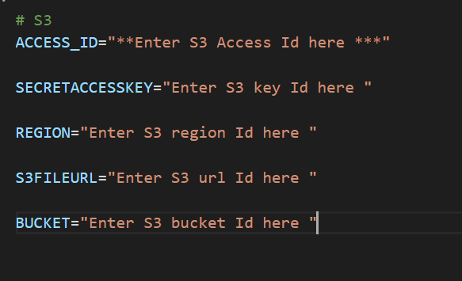

##### In the Live Site, i have given Register option only for Customers.
##### Whers as in Code Resposity, you will have Components for Admin Register.

```
	Restaurant Management Application.
	
	The Customer : will have permission upon login, to only view the Meal Item, dishes and Ingredients.
	
	The Admin : Have the Access to View, Add, Update and Delete the Meal Items.
	
```

### [Live Site(Go to live site and Explore)](https://master.d3r9m3wy07riln.amplifyapp.com/)

#### *** HomePage View ***
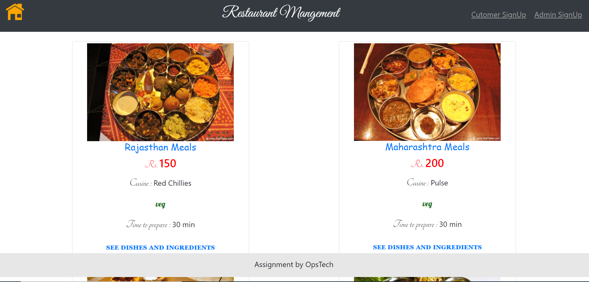

#### *** Customer Sign Up ***
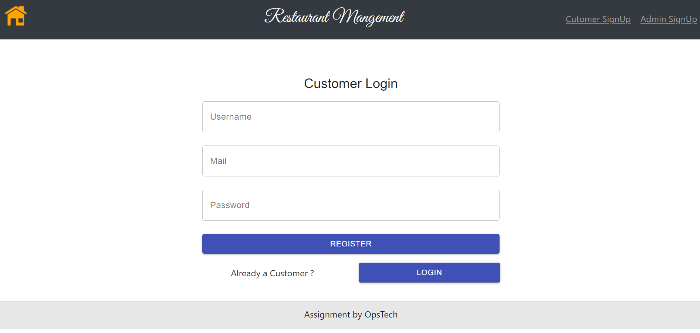

#### *** Admin Login ***
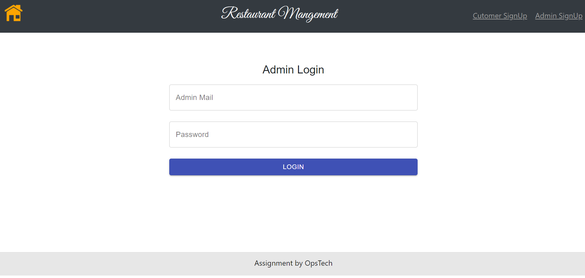

#### *** Customer Dashboard ***
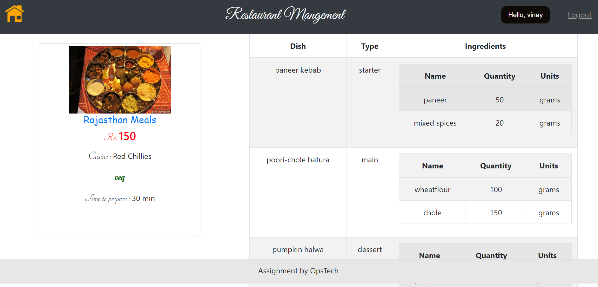

#### *** Customer Doesn't have Grant to Visit and Perform Admin Operations ***
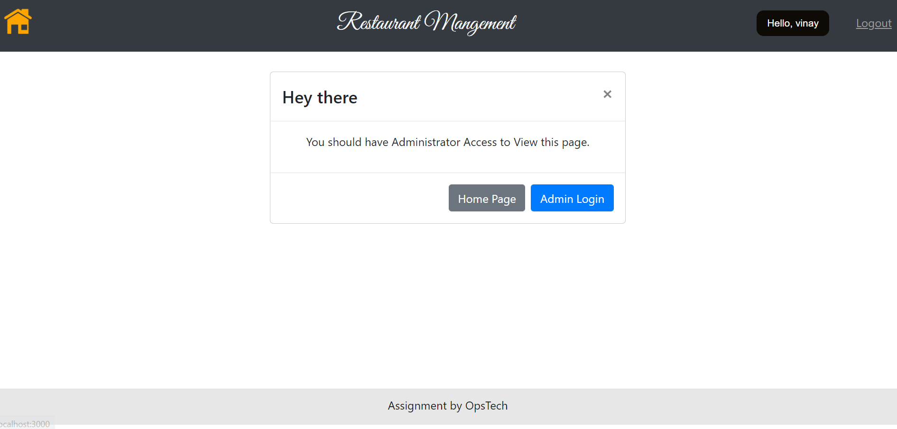

#### *** Admin Dashboard ***
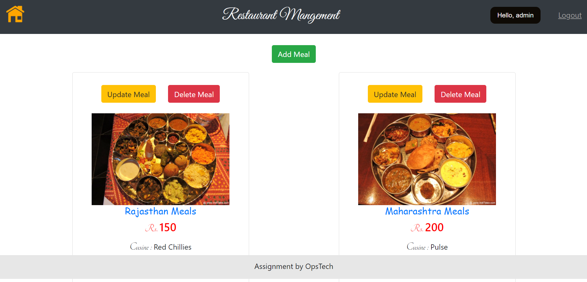

#### *** Admin Adding Meal ***
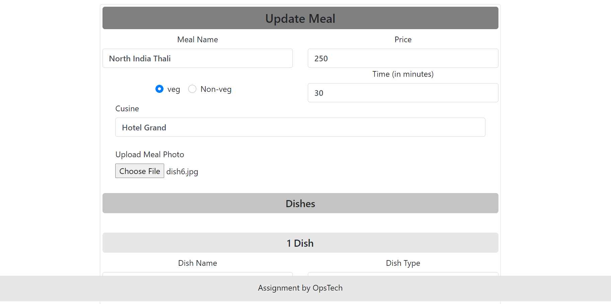

#### *** Ading Meal Item ***
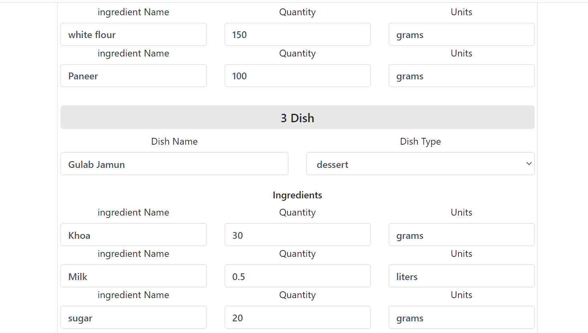

#### *** Confirmation Upon Successfull adding of Meal ***
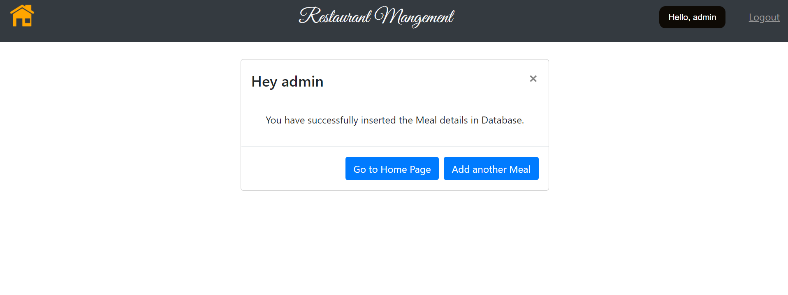

#### *** Inserted Meal Item ***
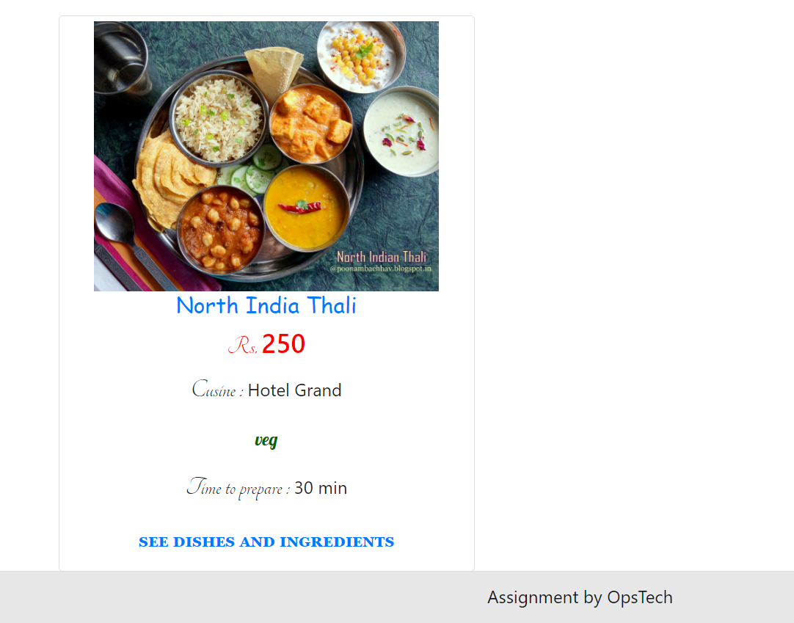

#### *** Inserted Meal Ingredients ***
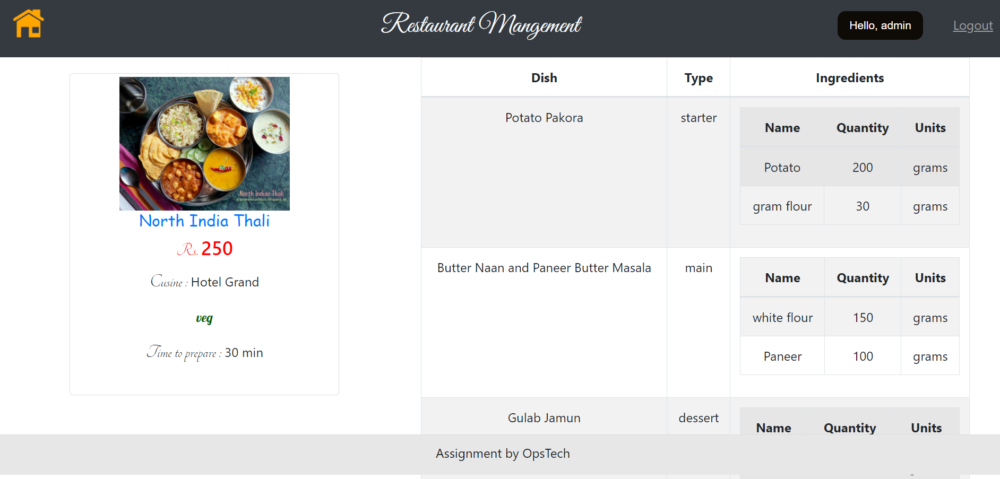

#### *** Meal Item before Update ***
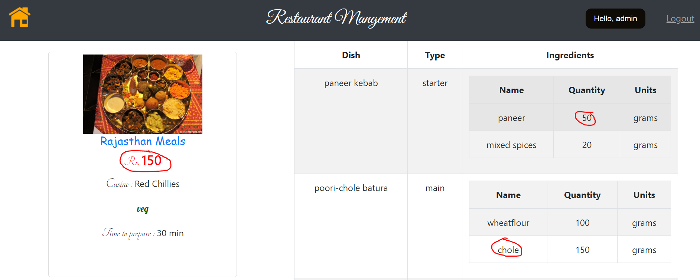

#### *** Meal Item After Update ***
